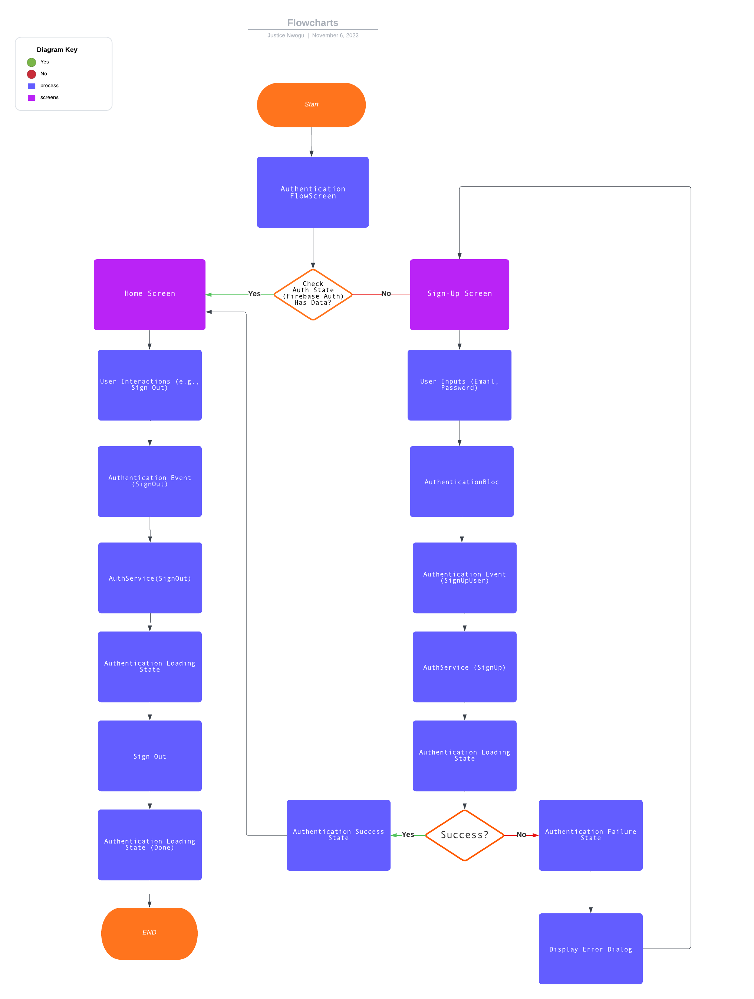

# User authentication

The objective with this pcoject are explore how to build secure user authentication in Flutter using Firebase for authentication and the Bloc state management pattern for handling application state. 

By the end, I will have a solid understanding of how to integrate Firebase authentication and implement a secure login and sign-up process using Bloc.

